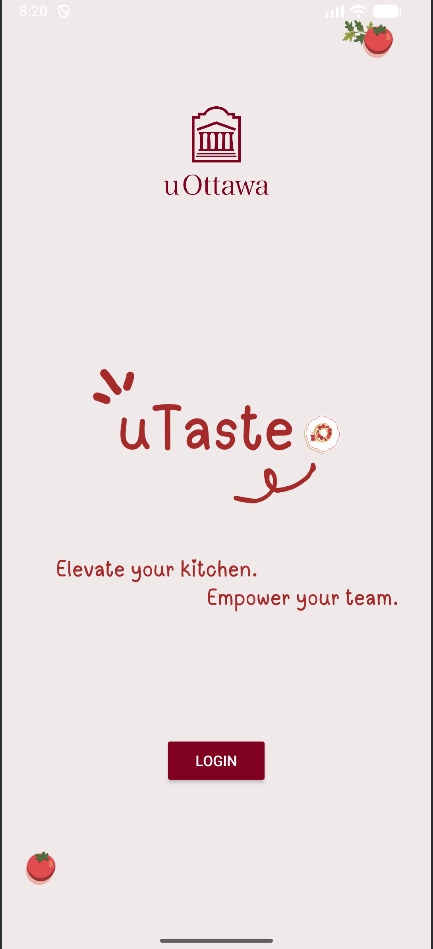
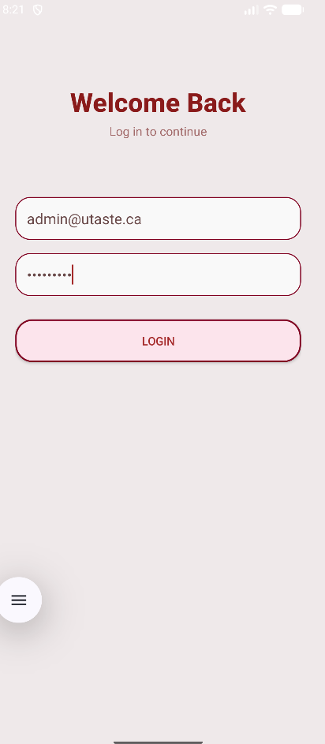
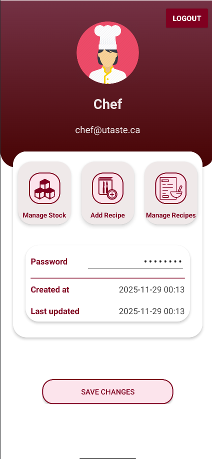
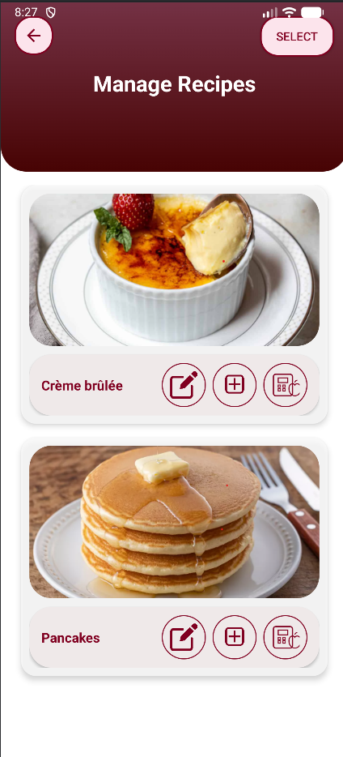
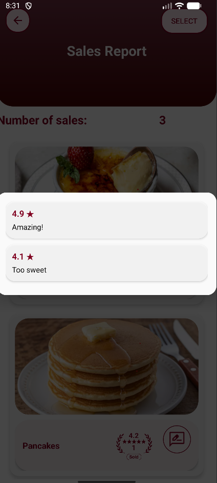

# uTaste – Restaurant Management App

uTaste is a multi-role Android application designed to help a restaurant manage recipes, ingredients, nutrition data, and sales. The app supports three user roles — Administrator, Chef, and Waiter — each with its own interface and permissions.

This project was built in Java using Android Studio, with a Room database and custom UI components.

---

## My Contributions

I worked on:

- Designing and implementing all screens, layouts, and UI elements  
- Creating the user flows for Administrator, Chef, and Waiter roles  
- Developing custom RecyclerView cards and adapters  
- Building dialogs for editing recipes, adding ingredients, and viewing nutrition  
- Connecting UI features to Room database logic  
- Implementing the sales report, nutrition summary, and feedback systems  
- Establishing a consistent visual identity and interface structure  

---

## Features

### **Administrator**
- Manage user accounts (add, edit, delete)
- Reset passwords  
- View account information and timestamps

### **Chef**
- Create, edit, and delete recipes  
- Add and manage ingredients  
- Compute recipe nutrition (calories, macronutrients)  
- View ingredient stock  

### **Waiter**
- View recipe list  
- Record sales with rating and feedback  
- View sales report including:  
  - total sales per recipe  
  - average rating  
  - quick review summaries  

---

## Tech Stack

- Java (Android)
- Room Database (entities, DAOs)
- XML Layouts
- RecyclerView and custom adapters
- Glide (image loading)
- Custom dialogs and UI components
- Background threading for long-running tasks

---

## Screenshots

  
  
  

  
  

---

## Installation

Clone the repository:

'''
git clone https://github.com/maimounafall/uTaste.git
'''
Open the project in **Android Studio**, wait for Gradle to sync, and run it on an emulator or physical device.

---

## Project Status

Fully completed and functional. Includes all major features: multi-role system, recipe management, ingredient handling, nutrition calculations, sales tracking, and feedback reporting.

